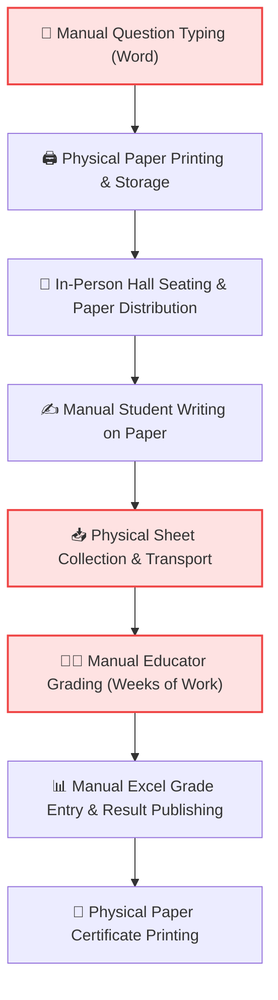
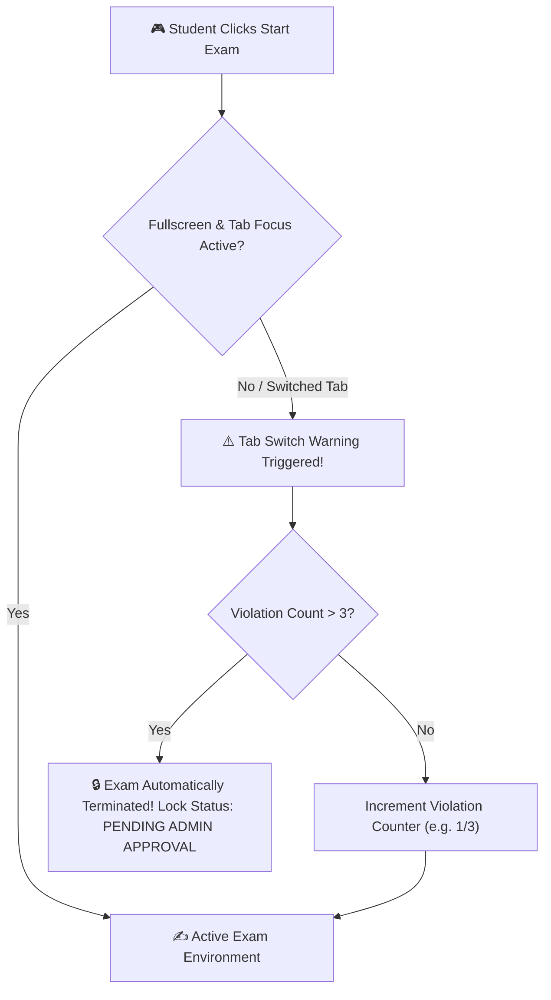
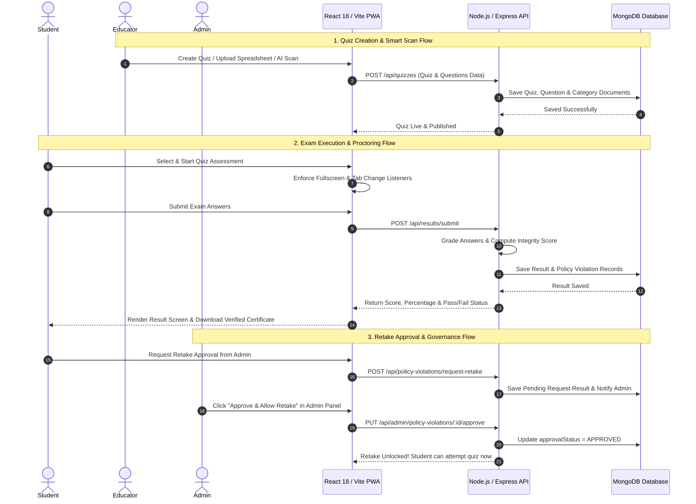
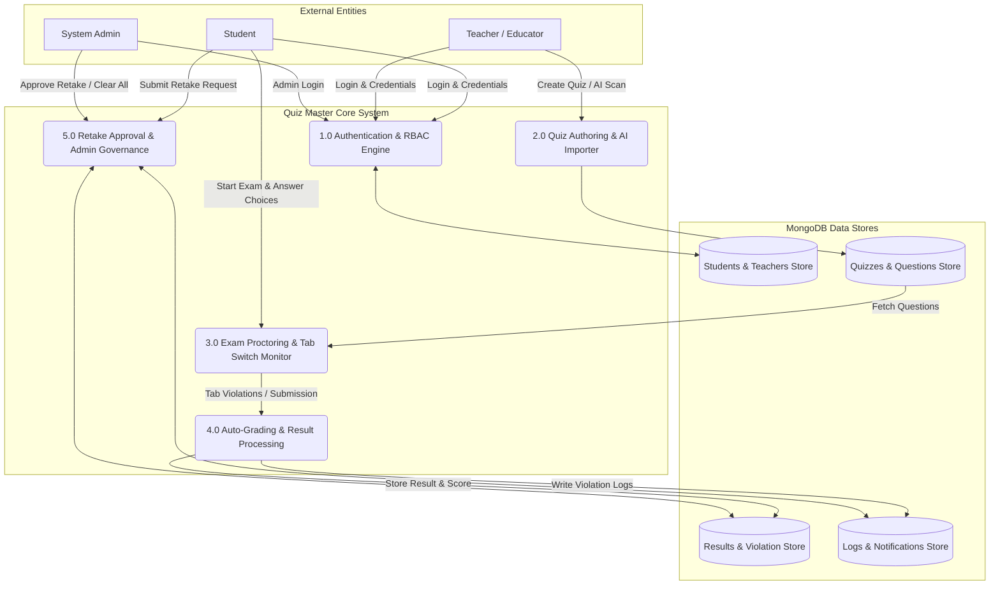

# 📊 Presentation 1: System Analysis & Requirements Presentation
## Quiz Master System — Online Assessment & Examination Platform

---

## 📌 Slide 1: Title & Project Overview

### **Quiz Master System: Next-Generation Assessment Platform**
*A comprehensive System Analysis and Requirements Specification for an enterprise-grade, full-stack, mobile-responsive online quiz and examination platform featuring anti-cheating proctoring, AI-assisted learning, and instant automated evaluation.*

| Project Attribute | System Details |
| :--- | :--- |
| **Project Title** | Quiz Master System (Online Quiz Management Platform) |
| **Document Type** | System Analysis & Requirements Presentation |
| **Platform Type** | Progressive Web Application (PWA) & Full-Stack Web Platform |
| **Target Organizations** | Academic Universities, K-12 Schools, Corporate HR, Training Institutes |
| **Core Architecture** | React 18, Vite 5, TailwindCSS, Node.js, Express.js, MongoDB |

---

## 🚀 Slide 2: Introduction

### **Background & Project Purpose**
In today's rapidly evolving educational landscape, traditional pen-and-paper examinations and basic unmonitored online forms fail to meet modern standards of security, accessibility, and speed. The **Quiz Master System** was conceived to solve these challenges by delivering a secure, scalable, and automated examination ecosystem.

> [!NOTE]
> **Core Mission**: Provide educational institutions and enterprises with a robust, zero-latency assessment platform that guarantees examination integrity, automates tedious grading, and delivers real-time learning analytics across all devices.

### **Primary System Objectives**
- 🛡️ **Enforce Exam Integrity**: Implement real-time anti-cheating controls, tab-switch warning limits, and window blur detection.
- ⚡ **Zero-Latency Evaluation**: Compute student results, percentage scores, and answer key breakdowns instantaneously.
- 🤖 **AI-Powered Capabilities**: Provide dynamic STEM/CS AI Tutoring and automated question generation via LLM integration.
- 📱 **Universal Mobile Access**: Ensure 100% responsive UI optimized for devices ranging from mobile smartphones to desktops.

---

## 🌐 Slide 3: System Scope & Functional Modules

```
                                  ┌──────────────────────────────────────────────┐
                                  │      QUIZ MASTER SYSTEM SCOPE & MODULES       │
                                  └──────────────────────┬───────────────────────┘
                                                         │
         ┌───────────────────────────────┬───────────────┴───────────────┬───────────────────────────────┐
         │                               │                               │                               │
         ▼                               ▼                               ▼                               ▼
┌──────────────────┐            ┌──────────────────┐            ┌──────────────────┐            ┌──────────────────┐
│  STUDENT PORTAL  │            │ TEACHER BUILDER  │            │ ADMIN GOVERNANCE │            │  AI & ANALYTICS  │
└────────┬─────────┘            └────────┬─────────┘            └────────┬─────────┘            └────────┬─────────┘
         │                               │                               │                               │
         ├─ Explore & Filter Quizzes     ├─ AI Smart Scan Builder        ├─ Policy Violation Control     ├─ 1-on-1 AI Tutor Q&A
         ├─ Secure Exam Proctoring       ├─ Bulk Excel/CSV Importer      ├─ Retake Request Approvals     ├─ Seeded Shuffling Engine
         ├─ Instant Score Breakdown      ├─ Question Bank Management     ├─ User Account Licensing       ├─ Global Leaderboards
         └─ Verified PDF Certificates    └─ Student Performance Metrics  └─ Database Architecture        └─ Automated Grading
```

---

## 🏢 Slide 4: Organization Profile — Target Ecosystems

The **Quiz Master System** is architected to integrate seamlessly into diverse organizational environments:

### **1. Higher Education & Universities**
- Conduct mid-term examinations, end-of-semester finals, and daily lab practice tests.
- Support multi-departmental categorization (Software Engineering, IoT, Web Services, AI/Data Science).

### **2. K-12 Schools & Coaching Academies**
- Provide students with interactive practice tests, instant feedback, and AI explanation modal guidance.

### **3. Corporate Enterprise & HR Onboarding**
- Automate technical hiring candidate screenings, employee onboarding quizzes, and compliance training audits.

### **4. Professional Certification Boards**
- Issue tamper-proof digital PDF certificates with verification hashes upon successful test completion.

---

## 👥 Slide 5: Organization Stakeholders & User Roles

| Role | Primary Responsibilities | Core System Needs |
| :--- | :--- | :--- |
| **Student Candidate** | Browse subjects, attempt proctored exams, view AI explanations, download certificates | Smooth mobile interface, clear countdown timer, instant results, retake request option |
| **Educator / Teacher** | Create quizzes, bulk import questions via spreadsheets, use AI Smart Scan, monitor attempt statistics | Fast authoring tools, flexible question types (MCQ, Multi-select, True/False), automated grading |
| **System Admin** | Oversee platform security, manage user accounts, review policy violations, approve retake requests, clear database logs | Centralized dashboard, policy violation management, one-click retake approvals, system audit logs |

---

## 📜 Slide 6: Existing System (Legacy Examination Workflow)

Most academic and corporate organizations currently rely on manual paper exams or basic digital survey forms:

### **Legacy Exam Creation & Conduct**
1. Teachers manually type out test papers in word processors.
2. Question sheets are physically printed, copied, and stored in locked rooms.
3. Students assemble in physical exam halls and write answers on paper sheets.
4. Answer sheets are manually collected, sorted, and handed to evaluators.

### **Legacy Basic Digital Forms (e.g. Standard Google Forms)**
- Basic online forms lack proctoring restrictions.
- Students can open external browser tabs, use search engines, or communicate during tests without detection.

---

## 🔄 Slide 7: Analysis of Legacy Examination Process



---

## ⚠️ Slide 8: Problem Areas of Existing System — Security & Integrity Defects

> [!CAUTION]
> Legacy paper and unmonitored digital testing methods suffer from severe security vulnerabilities that compromise academic integrity.

### **1. Unrestricted Web Searching & Tab Switch Misconduct**
- Standard web forms do not track window focus or browser tab changes, enabling students to look up answers on search engines or AI tools.

### **2. Question Paper Leakage Risks**
- Physical printing and transport of test booklets create opportunities for question paper leakages prior to exam dates.

### **3. Student Impersonation & Identity Fraud**
- Paper roll call checks are vulnerable to proxy test-takers and fake physical IDs.

---

## 📉 Slide 9: Problem Areas of Existing System — Operational & Financial Bottlenecks

> [!WARNING]
> Legacy workflows impose immense administrative stress, high paper costs, and slow evaluation turnaround.

| Defect Area | Legacy System Bottleneck | Consequence |
| :--- | :--- | :--- |
| **Evaluation Turnaround** | Manual paper correction takes 14 to 30 days | Delayed feedback hinders student learning progress |
| **High Paper & Print Costs** | Thousands of paper reams printed per semester | High recurring financial expenditure and environmental waste |
| **Human Errors in Scoring** | Manual tallying of marks on answer booklets | Frequent calculation errors leading to re-evaluation disputes |
| **Educator Burnout** | Hours spent manually typing and grading questions | Less time available for active teaching and student mentoring |
| **Mobile Incompatibility** | Paper booklets or broken desktop-only web interfaces | Mobile-first students cannot participate remotely |

---

## 🛡️ Slide 10: Need for the New System — Anti-Cheating & Proctoring Engine

To address legacy vulnerabilities, the **Quiz Master System** introduces an anti-cheating engine built directly into the web application:



### **Core Anti-Cheating Features**
- **Fullscreen Mode Enforcement**: Requests HTML5 Fullscreen upon starting.
- **Tab Change Monitoring**: Detects tab switches and window blur events in real-time.
- **Automated Attempt Lock**: Automatically terminates and locks exams upon exceeding violation thresholds.

---

## 💡 Slide 11: Need for the New System — Instant Grading & AI Mentorship

> [!IMPORTANT]
> **Quiz Master System** transforms digital assessment into an interactive, zero-delay learning environment.

### **1. 0-Second Instant Auto-Grading**
- Evaluates MCQ, Multi-select, True/False, and Short Answer questions instantly upon submission.
- Computes percentage, marks awarded, pass/fail status, and time taken.

### **2. 1-on-1 AI Tutor Q&A & Explanation Modal**
- Powered by Google Gemini LLM API integration.
- Provides step-by-step logic, code examples, and memory formulas for any quiz question.

### **3. Student Retake Request & Admin Unblocking**
- Students blocked by attempt limits or policy violations can submit a direct **"Request Retake Approval"** note to the Admin.
- When approved by Admin, the quiz is automatically unlocked for a retake attempt!

---

## 🔄 Slide 12: System Flow Diagram — End-to-End System Architecture



---

## 🧩 Slide 13: Data Flow Diagram (DFD Level 1 — Data Processing)



---

## 📈 Slide 14: Feasibility Study & Expected Business Impact

### **Feasibility Analysis**
- 🛠️ **Technical Feasibility**: Built on proven technologies (React, Node.js, Express, MongoDB, WebSockets) capable of handling concurrent exam sessions.
- 💼 **Operational Feasibility**: Intuitive UI requires zero training for students or educators; mobile PWA ensures access anywhere.
- 💰 **Economic Feasibility**: Open-source tech stack eliminates expensive licensing fees; zero paper printing costs.

### **Quantitative Business Impact**

| Evaluation Parameter | Legacy Paper System | Quiz Master System | Quantitative Benefit |
| :--- | :--- | :--- | :--- |
| **Grading Turnaround** | 14 – 30 Days | **Instant (0 Seconds)** | **100% Turnaround Acceleration** |
| **Quiz Creation Time** | 4 – 6 Hours | **5 Minutes (Bulk / AI Scan)** | **95% Reduction in Preparation Time** |
| **Paper Consumption** | ~50 Sheets / Student / Term | **0 Sheets** | **100% Paper & Cost Savings** |
| **Exam Integrity Lockout** | Unmonitored | **Real-time Tab & Blur Detection** | **Tamper-Proof Exam Environment** |
| **Mobile Accessibility** | Non-responsive / Paper only | **100% Mobile PWA (320px+)** | **Universal Device Compatibility** |
