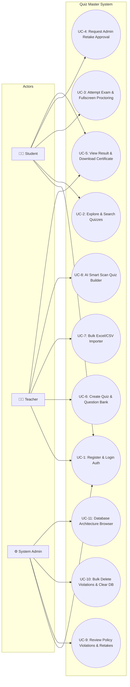
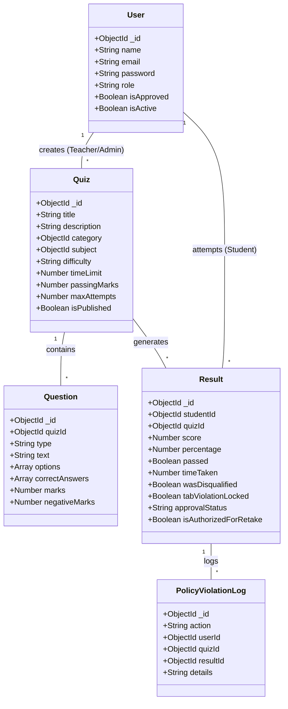
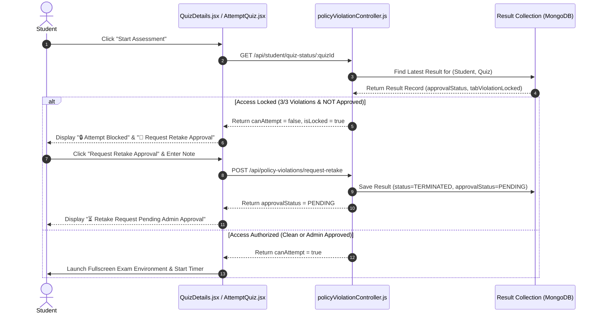
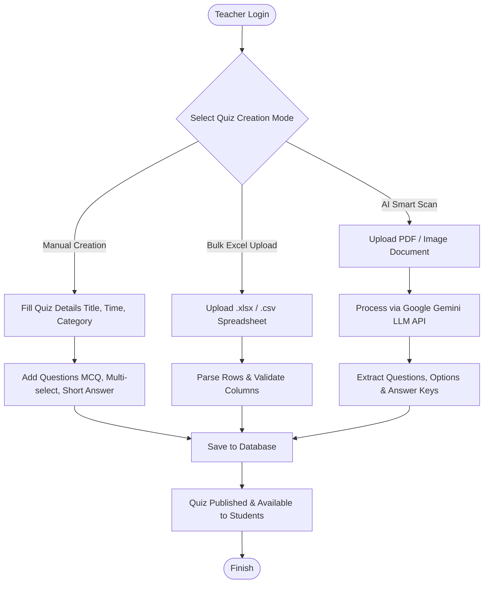
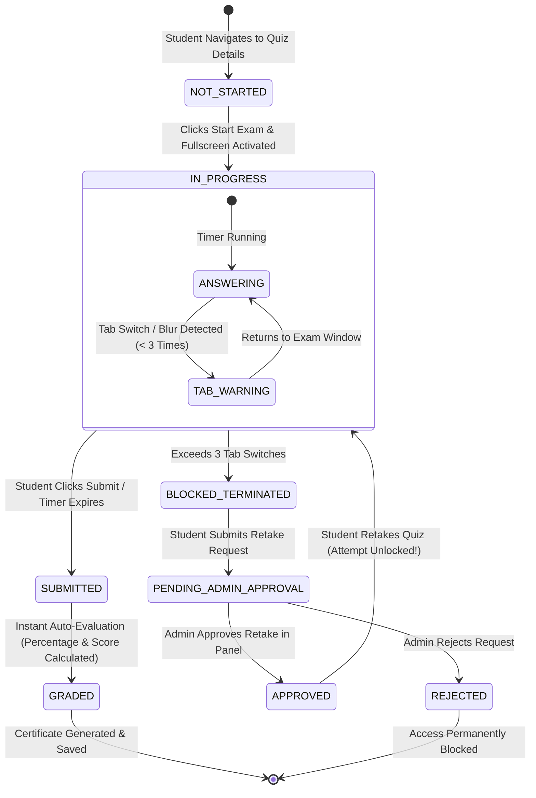

# 🎨 Presentation 2: System Design & Technical Implementation Presentation
## Quiz Master System — Full-Stack Architecture & Design Specifications

---

## 📌 Slide 1: Title & Architectural Overview

### **Quiz Master System: Technical Architecture & System Design**
*A production-grade, full-stack System Design specification detailing the Proposed Architecture, UML Behavioral & Structural Diagrams, Complete Data Dictionary (MongoDB Schemas), and User Interface Screen Specifications.*

| Architectural Pillar | Specification Details |
| :--- | :--- |
| **Frontend Framework** | React 18, Vite 5, Redux Toolkit, TailwindCSS, Lucide/FontAwesome Icons |
| **Backend Framework** | Node.js, Express.js (REST API Architecture), WebSockets (Socket.io) |
| **Database Engine** | MongoDB Atlas (NoSQL Document Store with Mongoose ODM) |
| **AI & LLM Services** | Google Gemini 1.5 LLM API & NLP STEM Engine |
| **Security & Auth** | JWT Tokens, Bcrypt Hashing, Role-Based Access Control (Student, Teacher, Admin) |

---

## 🚀 Slide 2: Proposed System — Architecture & Tech Stack

### **Modern Full-Stack Decoupled Architecture**
The **Quiz Master System** adopts a decoupled client-server architecture. The frontend React PWA communicates asynchronously with the backend Express API server over HTTP REST and WebSockets.

```
┌──────────────────────────────────────────────────────────────────────────────────────────┐
│                             CLIENT LAYER (React 18 PWA)                                  │
│   Landing Page ── Quizzes Explore ── Secure Proctoring Exam ── Admin Governance Panel   │
└──────────────────────────────────────────┬───────────────────────────────────────────────┘
                                           │  REST API (Axios) & WebSockets (Socket.io)
                                           ▼
┌──────────────────────────────────────────────────────────────────────────────────────────┐
│                            SERVER LAYER (Node.js & Express)                              │
│   Auth Middleware ── Policy Controller ── AI Controller ── Admin/Teacher Controller      │
└─────────────────────┬────────────────────┬────────────────────┬──────────────────────────┘
                      │                    │                    │
                      ▼                    ▼                    ▼
           ┌────────────────────┐┌────────────────────┐┌────────────────────┐
           │  MongoDB Database  ││  Google Gemini AI  ││   Twilio SMS /     │
           │  (Mongoose Schemas)││   (LLM Service)    ││   Nodemailer API   │
           └────────────────────┘└────────────────────┘└────────────────────┘
```

---

## ✨ Slide 3: Proposed System — Core Features & Innovations

> [!IMPORTANT]
> **Proposed System Key Innovations** over traditional testing software:

1. **Seeded Shuffling Algorithm (Mulberry32 PRNG)**:
   - Shuffles quiz questions and answer options deterministically based on a candidate seed, ensuring each student gets a unique order while maintaining grading consistency.
2. **Real-Time Proctoring & Policy Lock Engine**:
   - Detects off-screen tab switches, window blur events, and fullscreen exits.
   - Automatically locks accounts upon reaching 3/3 violations.
3. **Student Retake Request & Admin Override**:
   - Allows blocked students to request retake approval directly from the quiz screen.
   - Admin approval instantly overrides locks and grants quiz re-attempt access.
4. **Interactive AI Tutor Chat & Explanation Modal**:
   - Provides step-by-step logic, code examples, and formulas for quiz questions using dynamic AI.
5. **Database Browser with Populated Student Names**:
   - Displays real student names and emails in the MongoDB Architecture browser instead of raw ObjectIDs.

---

## 📐 Slide 4: UML Diagram 1 — Use Case Diagram



---

## 🏗️ Slide 5: UML Diagram 2 — Class Diagram (Entity Architecture)



---

## ⏱️ Slide 6: UML Diagram 3 — Sequence Diagram (Exam Execution & Proctoring)



---

## 🔄 Slide 7: UML Diagram 4 — Activity Diagram (Quiz Authoring & AI Smart Scan)



---

## 🔄 Slide 8: UML Diagram 5 — State Machine Diagram (Quiz Attempt Lifecycle)



---

## 📖 Slide 9: Data Dictionary 1 — User & Governance Collections

### **1. `Student` Collection (`models/Student.js`)**
| Field Name | Data Type | Validation / Constraints | Description |
| :--- | :--- | :--- | :--- |
| `_id` | ObjectId | Primary Key, Auto-generated | Unique Student ID |
| `name` | String | Required, Trimmed | Full Name of Student Candidate |
| `email` | String | Required, Unique, Lowercase | Student Email Address (Login Identifier) |
| `password` | String | Required, Min length 6 | Bcrypt Password Hash |
| `phone` | String | Optional | Contact Mobile Number |
| `avatar` | String | Default: DiceBear SVG | Profile Image URL |
| `isApproved` | Boolean | Default: `true` | Admin Approval Status |
| `isActive` | Boolean | Default: `true` | Account Active Status |

### **2. `Admin` Collection (`models/Admin.js`)**
| Field Name | Data Type | Validation / Constraints | Description |
| :--- | :--- | :--- | :--- |
| `_id` | ObjectId | Primary Key | Unique Admin ID |
| `name` | String | Default: "System Administrator" | Admin Display Name |
| `email` | String | Required, Unique | System Admin Email (`admin@quizsystem.com`) |
| `password` | String | Required | Bcrypt Password Hash (`Admin@123`) |
| `role` | String | Fixed: `'admin'` | System Root Administrator Role |

---

## 📖 Slide 10: Data Dictionary 2 — Assessment Collections

### **1. `Quiz` Collection (`models/Quiz.js`)**
| Field Name | Data Type | Validation / Constraints | Description |
| :--- | :--- | :--- | :--- |
| `_id` | ObjectId | Primary Key | Unique Quiz ID |
| `title` | String | Required | Title of Exam / Quiz Assessment |
| `category` | ObjectId | Ref: `'Category'`, Required | Main Category ID |
| `subject` | ObjectId | Ref: `'Subject'`, Required | Specific Subject Subfield ID |
| `difficulty` | String | Enum: `['easy', 'medium', 'hard']` | Quiz Difficulty Level |
| `timeLimit` | Number | Required, Min: 1 | Time Limit in Minutes |
| `passingMarks` | Number | Required | Minimum Marks Needed to Pass |
| `maxAttempts` | Number | Default: `3` | Permitted Attempt Count |
| `isPublished` | Boolean | Default: `true` | Visibility to Students |

### **2. `Question` Collection (`models/Question.js`)**
| Field Name | Data Type | Validation / Constraints | Description |
| :--- | :--- | :--- | :--- |
| `_id` | ObjectId | Primary Key | Unique Question ID |
| `quizId` | ObjectId | Ref: `'Quiz'`, Required | Parent Quiz Reference ID |
| `type` | String | Enum: `['mcq', 'multi-select', 'true-false', 'short-answer']` | Question Format Type |
| `text` | String | Required | Question Text Prompt |
| `options` | Array[String]| Array of Choice Options | Multiple Choice Options List |
| `correctAnswers`| Array[String]| Required | Correct Answer Values |
| `marks` | Number | Default: `1` | Marks Awarded for Correct Answer |

---

## 📖 Slide 11: Data Dictionary 3 — Results & Log Collections

### **1. `Result` Collection (`models/Result.js`)**
| Field Name | Data Type | Validation / Constraints | Description |
| :--- | :--- | :--- | :--- |
| `_id` | ObjectId | Primary Key | Unique Result Record ID |
| `studentId` | ObjectId | Ref: `'Student'`, Required | Student Candidate ID |
| `quizId` | ObjectId | Ref: `'Quiz'`, Required | Attempted Quiz ID |
| `score` | Number | Required, Default: 0 | Total Score Achieved |
| `percentage` | Number | Required, Default: 0 | Calculated Percentage Metric |
| `passed` | Boolean | Default: `false` | Pass / Fail Determination |
| `timeTaken` | Number | Default: 0 | Time Spent in Seconds |
| `wasDisqualified`| Boolean | Default: `false` | Disqualified due to Anti-Cheating |
| `tabViolationLocked`| Boolean | Default: `false` | Locked out by Tab Switch Monitor |
| `approvalStatus` | String | Enum: `['NONE', 'PENDING', 'APPROVED', 'REJECTED']` | Retake Approval Status |
| `isAuthorizedForRetake`| Boolean | Default: `false` | Admin Retake Override Flag |

### **2. `PolicyViolationLog` Collection (`models/PolicyViolationLog.js`)**
| Field Name | Data Type | Validation / Constraints | Description |
| :--- | :--- | :--- | :--- |
| `_id` | ObjectId | Primary Key | Audit Log Event ID |
| `action` | String | Enum: `['TAB_SWITCH_DETECTED', 'QUIZ_TERMINATED', 'ADMIN_APPROVED', 'ADMIN_REJECTED', 'RETAKE_REQUESTED']` | Log Action Type |
| `userId` | ObjectId | Ref: `'Student'`, Required | Student Reference |
| `quizId` | ObjectId | Ref: `'Quiz'` | Quiz Reference |
| `details` | String | Description Note | Detailed Event Context |

---

## 🖼️ Slide 12: User Interface Screens 1 — Landing Page & Explore Quizzes

### **1. Responsive Landing Page (`LandingPage.jsx`)**
- **Hero Section**: Clean typography with interactive call-to-action buttons ("Explore Quizzes", "Start Free Assessment").
- **Feature Cards**: Highlights anti-cheating proctoring, AI tutoring, bulk Excel import, and PDF certification.
- **Quick Demo Login Pills**: 1-click shortcuts for Admin, Student, and Teacher roles.

### **2. Quizzes Exploration Page (`QuizzesPage.jsx`)**
- **Category Filter Dropdown**: Simplified category selection (`Software Engineering`, `Internet of Things`, `Web Services & SOA`, `Computer Science & Algorithms`, `Database Systems & SQL`, `Artificial Intelligence & Data Science`, `Custom`).
- **Search Bar & Grid Cards**: Real-time filtering by quiz title or subject with difficulty badges and attempt counts.

---

## 🖼️ Slide 13: User Interface Screens 2 — Exam Environment & Proctoring

```
┌──────────────────────────────────────────────────────────────────────────────────────────┐
│ ⏱️ Time Remaining: 14:32  │  Artificial Intelligence Exam  │  Progress: Question 4 of 10   │
└──────────────────────────────────────────────────────────────────────────────────────────┘
┌───────────────────────────────────────────────────────────┐ ┌────────────────────────────┐
│ Question 4:                                               │ │ Question Navigation Palette│
│ What is the time complexity of searching in a Balanced   │ │ ┌───┐ ┌───┐ ┌───┐ ┌───┐    │
│ Binary Search Tree (BST)?                                 │ │ │ 1 │ │ 2 │ │ 3 │ │ 4*│    │
│                                                           │ │ └───┘ └───┘ └───┘ └───┘    │
│  ◯  A) O(1)                                               │ │ ┌───┐ ┌───┐ ┌───┐ ┌───┐    │
│  🔘 B) O(log N)                                           │ │ │ 5 │ │ 6 │ │ 7 │ │ 8 │    │
│  ◯  C) O(N)                                               │ │ └───┘ └───┘ └───┘ └───┘    │
│  ◯  D) O(N log N)                                         │ │                            │
│                                                           │ │ ⚠️ Warning Status: 0/3     │
│ [ ⬅️ Previous ]                           [ Next ➡️ ]    │ │ Fullscreen Mode Active 🟢  │
└───────────────────────────────────────────────────────────┘ └────────────────────────────┘
```

- **Countdown Timer**: Header-anchored live countdown timer with auto-submit on expiration.
- **Seeded Shuffling**: Shuffled question sequence unique to each candidate.
- **Proctoring Overlay**: Displays warning toasts on window blur or tab changes.

---

## 🖼️ Slide 14: User Interface Screens 3 — Retake Request & Admin Policy Violations

### **1. Quiz Detail Screen with Attempt Lock & Request Retake (`QuizDetails.jsx`)**
- **Attempts Logged**: Displays `3 / 3` attempt status.
- **Banner Notice**: `Starting is disabled. You can request admin approval to retake this quiz below.`
- **Action Buttons**:
  - **`📩 Request Retake Approval from Admin`**: Opens popup modal to enter request note for Admin.
  - **Status Update**: Updates button to `⏳ Retake Request Pending Admin Approval` once submitted.
  - **`🎮 Start Assessment (Admin Authorized)`**: Green button activated instantly when Admin approves!

### **2. Admin Policy Violations Management (`PolicyViolations.jsx`)**
- **Metrics Cards**: Displays total violations, pending approval (orange), approved (green), and rejected (red).
- **Header Actions**:
  - **`Refresh`** button to update violation list.
  - **`Delete All`** button to clear all policy violation records from both website and MongoDB database simultaneously.
- **Action Table**: `Approve & Allow Retake`, `Reject`, `Delete Record`, and `View Audit Details`.

---

## 🖼️ Slide 15: User Interface Screens 4 — AI Smart Scan & Database Browser

### **1. AI Smart Scan Quiz Builder (`SmartScanQuizBuilder.jsx`)**
- **Document Uploader**: Upload PDF or Image document sheets.
- **Google Gemini LLM Integration**: Automatically parses text, extracts questions, choices, and correct answer keys, generating a full quiz in seconds.

### **2. MongoDB Database Architecture Browser (`DatabaseManagement.jsx`)**
- **Populated Student Names**: Displays real student names and emails (`John Doe (john@example.com)`) in `results`, `certificates`, and `notifications` tables instead of raw ObjectIDs.
- **`Delete All` Button**: One-click deletion of all collection documents directly from MongoDB.
- **Sample Data Seeder**: `Seed Sample Data` button to populate clean demo categories and quizzes.
